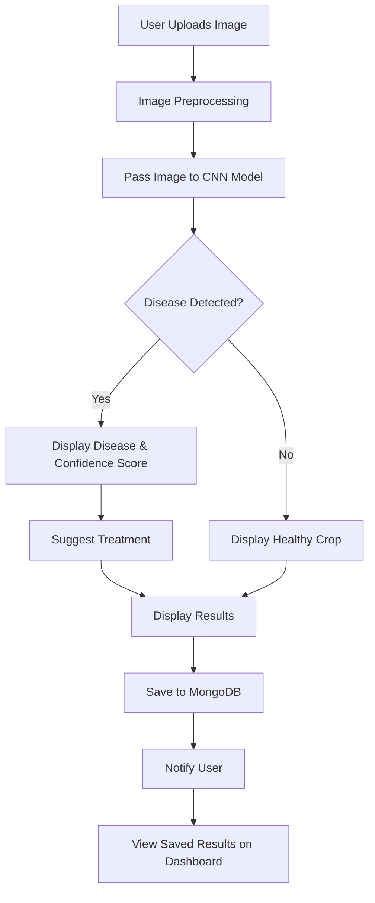

---

# AI Crop Disease Detection

This project aims to assist farmers by providing an AI-powered solution to detect diseases in crops through image analysis. The system uses machine learning models trained on crop images to identify diseases and provide treatment suggestions. The goal is to help farmers detect crop diseases early and take necessary actions to reduce crop losses.

## Key Features
- **Real-time Disease Detection**: Uses AI to analyze crop images and detect diseases in real-time.
- **Supports Multiple Crops**: Can detect diseases in various crops like wheat, rice, corn, etc.
- **Accurate Disease Classification**: Based on deep learning models like CNNs (ResNet50, EfficientNet).
- **Offline Availability**: Works offline for use in areas with limited connectivity.
- **User-friendly Interface**: Simple and easy-to-use interface for uploading crop images and viewing results.

## Technology Stack
- **Frontend**: React.js
- **Backend**: Flask (REST API for model inference)
- **Machine Learning Framework**: TensorFlow / PyTorch
- **Database**: MongoDB (for storing user data, historical results)
- **Cloud Services**: AWS EC2 (for scalable deployment)

## Project Architecture

The following flowchart outlines the basic workflow of the AI Crop Disease Detection system:



### Explanation:
1. **Image Upload**: The user uploads a crop image through the frontend.
2. **Image Preprocessing**: The image is resized and normalized before being fed into the AI model.
3. **Model Inference**: The trained model predicts the crop disease based on the input image.
4. **Decision Point**: If a disease is detected, the system displays the disease type and recommended treatment. If no disease is detected, it displays that the crop is healthy.
5. **Result Display**: The result is shown to the user in the frontend, along with bounding boxes (if applicable).
6. **Data Storage**: The results (disease type, crop image, and recommendations) are stored in the database for future reference.
7. **Notifications**: The user receives a notification about the result and can view it in their dashboard.

## How It Works
1. **Data Collection**: The system uses a large dataset of crop images labeled with corresponding diseases. The dataset is essential for training the AI model.
2. **Training the Model**: A Convolutional Neural Network (CNN) is trained using TensorFlow or PyTorch to recognize diseases in crops from images.
3. **Image Upload**: The user can upload an image of a crop through the frontend.
4. **Disease Prediction**: The model classifies the crop image, predicting the disease (if any) or confirming that the crop is healthy.
5. **Result Display**: The predicted disease, along with a confidence score and suggested treatment, is displayed to the user.

## Installation

### Prerequisites
- Python 3.x
- TensorFlow or PyTorch
- Flask
- Node.js (for frontend)
- MongoDB

### Steps
1. Clone the repository:
   ```bash
   git clone https://github.com/your-username/crop-disease-detection.git
   ```
2. Install the required backend dependencies:
   ```bash
   cd backend
   pip install -r requirements.txt
   ```
3. Install the frontend dependencies:
   ```bash
   cd frontend
   npm install
   ```
4. Download and place the pre-trained model in the `models` directory or train your own model using the PlantVillage dataset.
5. Run the backend server:
   ```bash
   python app.py
   ```
6. Run the frontend application:
   ```bash
   npm start
   ```
7. Open the application in your browser at `http://localhost:3000`.

## Dataset
This project uses the **PlantVillage dataset**, a publicly available dataset containing labeled images of diseased and healthy crops. The dataset can be downloaded from [Kaggle](https://www.kaggle.com/emmarex/plantdisease).

## Model Information
- **Model Architecture**: Convolutional Neural Network (ResNet50, EfficientNet)
- **Input Size**: 224x224 RGB image
- **Output**: The predicted disease class and confidence score
- **Evaluation Metrics**: Accuracy, Precision, Recall, F1-Score

## Cloud Deployment
To ensure scalability and performance, the application is deployed on **AWS EC2**. You can easily configure your instance and deploy the Flask and React.js apps on the cloud.

### Steps for Deployment:
1. Launch an EC2 instance with a Python and Node.js environment.
2. Clone the repository to the EC2 instance.
3. Install the required dependencies using the steps mentioned above.
4. Configure security groups to allow inbound HTTP/HTTPS traffic.
5. Use a process manager like **PM2** to keep the server running.
6. Optionally, set up a domain and SSL certificate for secure access.

## Future Enhancements
- **Mobile App Development**: Build a mobile app for use in remote areas.
- **Expand Crop and Disease Types**: Extend support to more crops and more specific disease types.
- **Multi-Language Support**: Add support for multiple languages for better accessibility to farmers globally.
- **Integrate Satellite Imagery**: Extend the project to support aerial and satellite imagery for large-scale disease monitoring.
- **Real-time Notification System**: Implement SMS or push notifications for real-time alerts.

## Contributing
We welcome contributions! Please open an issue or submit a pull request if you have suggestions or improvements.

### Steps for Contributing:
1. Fork the repository.
2. Create a new feature branch.
3. Commit your changes.
4. Push the changes and create a pull request.
   
## License
This project is licensed under the MIT License - see the [LICENSE](LICENSE) file for details.

## Contact
If you have any questions or feedback, feel free to reach out:

- Email: [youremail@example.com](mailto:youremail@example.com)
- GitHub: [your-username](https://github.com/your-username)
